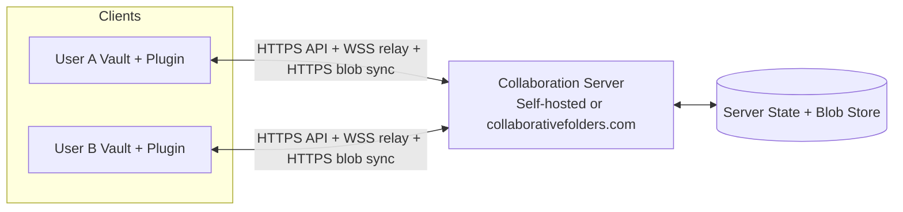

# Data Flow and Encryption

Two deployment modes are supported: self-hosted backend or managed hosted backend.

Protocol details:
- HTTPS API: invites, auth/refresh, membership, key lifecycle.
- WSS relay: encrypted realtime CRDT updates/snapshots plus awareness/presence signaling.
- HTTPS blob sync: encrypted attachment upload/download.

## Flow details

1. User shares a folder in Obsidian and server-side membership/invite metadata is created.
2. Each client has a local asymmetric keypair (private key stays local; public key is registered to the server).
3. Invite recipient joins using an invite token; plugin stores folder-scoped access/refresh tokens in plugin data.
4. Owner bootstraps/maintains folder key epochs and uploads wrapped content-key envelopes for active members.
5. Clients establish realtime collaboration sessions (Yjs over WebSocket rooms with encrypted doc updates/snapshots and awareness/presence signaling).
6. Binary attachments are synchronized via encrypted blob upload/download endpoints.
7. Clients decrypt locally and apply updates into vault files/folders through Obsidian APIs.
8. On member removal, tokens/sessions are revoked. Folder key epoch rotation is performed when a rotate payload is supplied (the plugin owner's removal flow does this), providing forward secrecy for future writes.

## Encryption model

- Encryption is client-side using Web Crypto:
  - Content encryption: `AES-GCM` (256-bit key, random 12-byte nonce).
  - Key wrapping (current plugin implementation): per-client `RSA-OAEP` (`SHA-256`) for folder content-key envelopes.
- Key hierarchy:
  - One long-lived client keypair per `clientId` (generated locally).
  - One active symmetric folder content key per key epoch.
  - Content key is wrapped to each active member's public key and stored server-side as envelopes.
- What the server can and cannot read:
  - Can read: control-plane metadata (folder/member/invite/token state), room names (including relative path in doc rooms), blob digests/sizes, awareness/presence payload metadata, timestamps, and audit/security logs.
  - Cannot read: note body plaintext and blob plaintext in transit/storage under the `v2` encrypted sync model.
- Local key custody:
  - Private key and cached folder content keys are stored on-device in local storage (`obsidian-teams:v2:*` namespace).
  - Access/refresh tokens are stored in Obsidian plugin data for that vault.
- Rotation and revocation:
  - Access tokens are short-lived JWTs (default server TTL: 30 minutes).
  - Refresh tokens are opaque, rotated on use, and stored hashed at rest.
  - WS auth uses single-use short-lived tickets.
  - Member removal path revokes refresh-token family and closes/revokes active sessions; folder key epoch rotates only when a rotate payload is supplied (otherwise response indicates `rekeyRequired`).
- Recovery expectations:
  - If local private key/cache is lost, client registers a new public key and needs owner envelope coverage (or rekey) to continue decrypting active epoch content.
  - Historical epochs without locally cached keys remain unreadable unless corresponding envelopes/keys are available.
